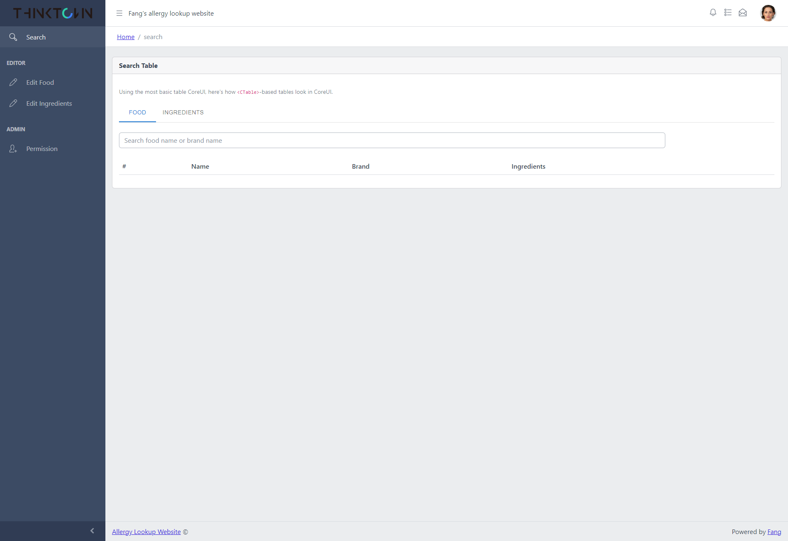

Allergy项目第八节课\
老师：刘心语 Max\
学生：方旭浩\
用时：1小时

# Menu routing

左侧可以看到我们现在已经有Menu了。之后对menu的改动可以在`menu.js`和`routes.js`中进行编辑。代码不难，只需要依样画葫芦就行

# Content 页面
要改动代码之前首先得知道在哪里进行改动。每一个页面对应的文件位置可以在`routes.js`中看到。假如我们要找 Edit Food 页面的代码，那么可以在`routes.js`中可以看到
```js
const Food = React.lazy(() => import('./views/editor/Food'))

// ...

{ path: '/editor/food', name: 'food', element: Food },
```

## 页面内容
我们用的React框架最后一般都会有一个
```js 
return (
    <Blahblah>
        ...
    </Blahblah>
)
```
而这个其实就是将html代码转化成了React.Component的形式。其中大部分component都是直接引用于网上写好的library。这个project中主要用到了以下几个library

1. [Mui/material](https://mui.com/material-ui/getting-started/)
2. [Coreui/react](https://coreui.io/react/docs/getting-started/introduction/)
3. [Mui/x-data-grid](https://mui.com/x/react-data-grid/)
4. [React-select](https://react-select.com/home)
  
当以上这些不满足编程需求的时候可以在网上查找各种React component并且下载进行使用。

### React State
React中很多function的作用和其他语言中的class作用相同，用`src/utils/common.js`举个例子
```js 
export default function Food() {
  // 变量
  const [loading, setLoading] = React.useState(false)
  const [data, setData] = React.useState([])
  const [textInput, setTextInput] = React.useState("")
  const [visible, setVisible] = React.useState(false)

  // 函数
  const searchFood = debounce((input) => {
    // ...
  }, 500)

  const loadingIcon = () => {
    // ...
  }

  React.useEffect(() => {
    // ...
  })

  // 输出结果
  return (
    <>
    </>
  )
}
```

我们可以看到common其实是当作一个class来使用的，每一个component其实就是一个被写成function的class
```js 
class Food extends React.Component {
    // 变量
  this.state = {
    loading: false,
    data: [],
    textInput: "",
    visible: false
  }

  // 函数
  const searchFood = debounce((input) => {
    // ...
  }, 500)

  const loadingIcon = () => {
    // ...
  }

  componentDidMount() {
    // 基本等同于useEffect
  }

  // 输出结果
  render() {
    return (
      <div><div/>
    )
  }
}
```

# 网络请求